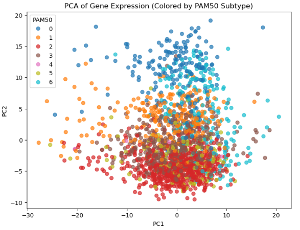
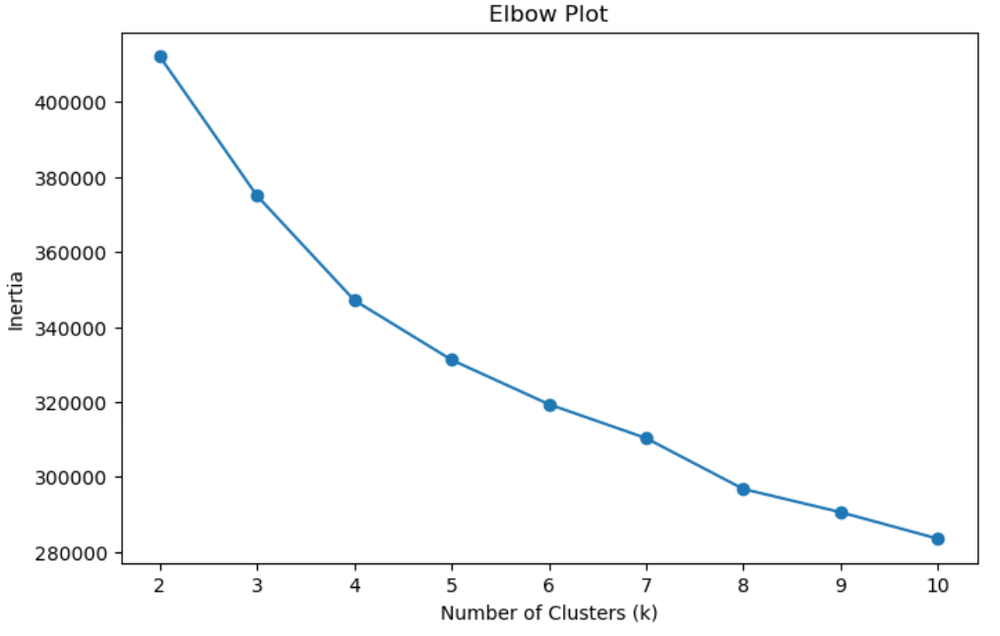
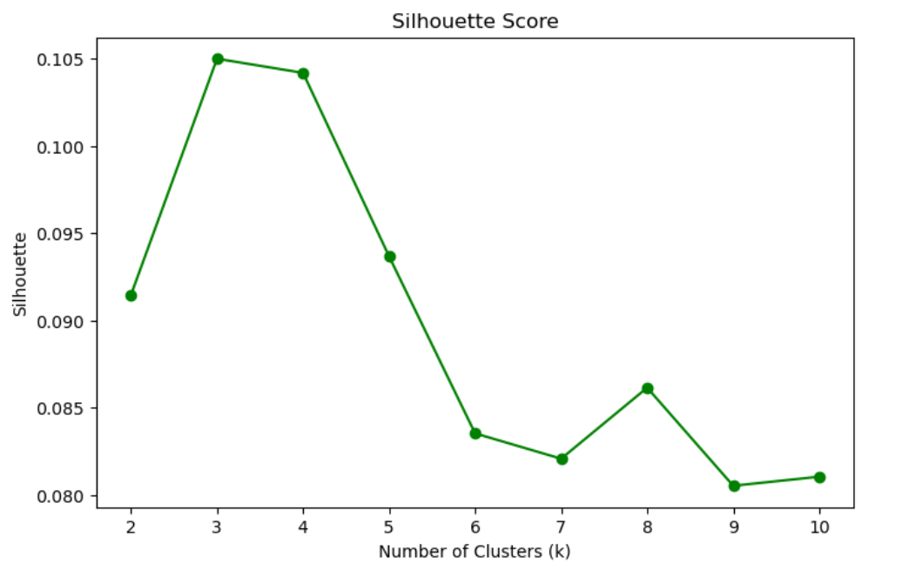
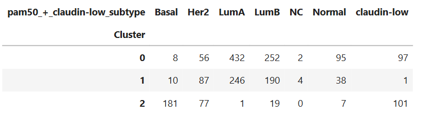
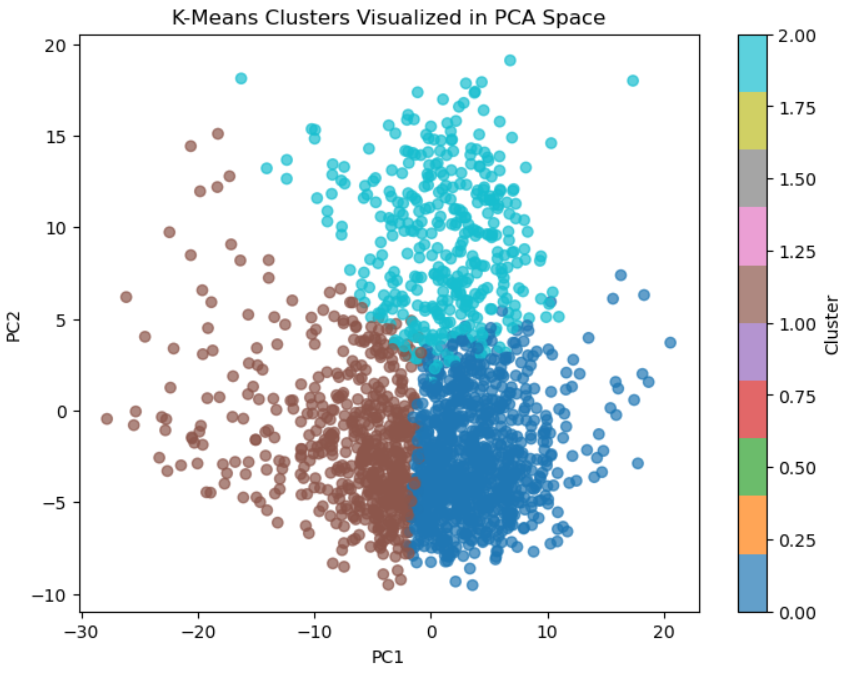

  

# 🧬 METABRIC Breast Cancer Gene Expression: PCA + K-Means Clustering

This project applies **dimensionality reduction (PCA)** and **unsupervised clustering (K-Means)** to real breast cancer gene-expression data from the **METABRIC** study, one of the largest genomic breast-cancer cohorts (1,904 patients).

The goal is to discover natural patient groups using only gene-expression features (no labels), and compare them with known medical subtypes.

---

## 📁 Dataset Overview

- **Source:** METABRIC (cBioPortal / Kaggle)
- **Samples:** 1,904 patients  
- **Features:**  
  - **489 gene expression z-scores**  
  - **Clinical columns** (metadata), not used for clustering  
- **Task:** Unsupervised clustering of gene expression profiles  
- **Method:** PCA → K-Means → Medical interpretation using PAM50 subtypes  

---

## 🔬 Why Gene Expression Only?

Gene expression profiles directly reflect the **biological behavior of tumors**.  
By clustering only the gene features, we discover **molecular subgroups** without mixing in clinical labels.

This mimics how real genomic subtyping (like PAM50) works.

---

## 🧹 Preprocessing Steps

1. Loaded METABRIC RNA expression dataset  
2. Extracted only **gene expression columns**  
3. Checked & confirmed **0 missing values**  
4. Removed zero-variance genes  
5. Standardized all gene features  
6. Final shape used for PCA: **(1904 samples, 489 genes)**  

---

## 📉 Dimensionality Reduction (PCA)

- PCA applied to all 489 genes  
- First few principal components captured most of the variance  
- PCA scatterplots show clear separation between emerging clusters

### **PCA Visualization**
(PC1 vs PC2)

  

**Interpretation (simple):**  
PC1 and PC2 capture broad gene-expression patterns.  
A long spread along the axes suggests strong biological variability among patients.

---

## 🔍 Choosing Number of Clusters (k)

### **Elbow Method**
- Sharp drop from **k = 2 → 4**
- After k = 4, curve flattens → little improvement

  

### **Silhouette Score**
- Peaks around **k = 3-4**, meaning good separation

  

📌 **Final Decision: k = 3**

---

## 🧩 K-Means Clustering Results

Three clear molecular clusters were discovered: Cluster vs PAM50 Comparison

  

Cluster 0 → Mostly LumA / LumB (less aggressive)

Cluster 1 → Mixed LumA / LumB / Her2 (intermediate)

Cluster 2 → Mostly Basal + Claudin-low (more aggressive)

### What are these subtypes? (Simple Awareness)

- **LumA / LumB** → Slower-growing, hormone-positive types  
- **Her2** → Faster-growing but highly treatable  
- **Basal / Claudin-low** → More aggressive molecular tumors  

### Why this matters  
Even without using labels, the clusters **align with real biological subtypes**, showing that gene-expression patterns alone reveal meaningful groups.

---

## 🎨 Cluster Visualization (PCA Space)

  

  

**Interpretation:**  
Clusters separate distinctly in PCA space, confirming that K-Means is capturing real structure in gene expression data.

---

## 🧠 Key Insights

- PCA successfully reduced 489 genes into a small set of components with high variance retention  
- K-Means created **3 stable and interpretable clusters**  
- Clusters strongly correlate with known clinical subtypes (PAM50)  
- The unsupervised model discovered real tumor groups **without ever seeing medical labels**

---

---

## 🚀 Future Work

- Apply **t-SNE or UMAP** for nonlinear dimensionality reduction  
- Use **Hierarchical Clustering** to explore finer subgroups  
- Perform **survival analysis per cluster**  
- Analyze **top genes driving each cluster**  
- Build a **web dashboard** for cluster exploration  

---

## 👩🏽‍💻 Author

**Hermela Seltanu Gizaw**  
BSc. Data Science & Analytics — USIU-Africa  
Mastercard Foundation Scholar  

--
